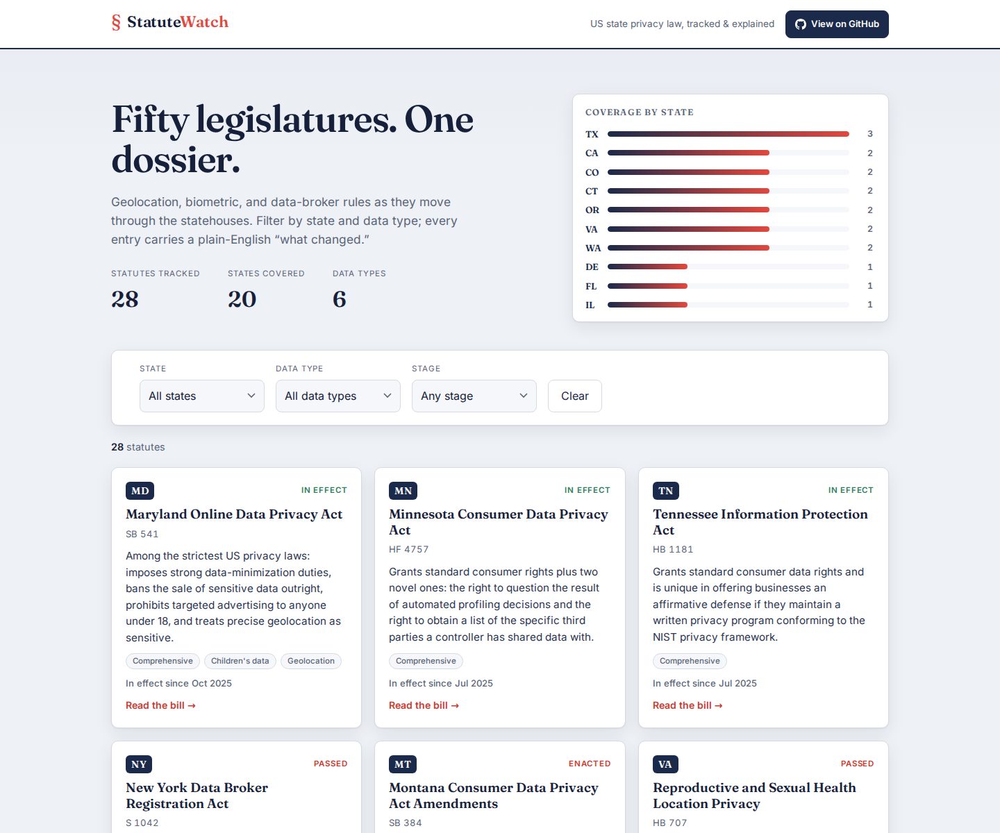

# Statute Watch

**▶ Live demo: [apps.charliekrug.com/statute-watch](https://apps.charliekrug.com/statute-watch/)**

[](https://github.com/ctkrug/statute-watch/actions/workflows/ci.yml)
[](LICENSE)
[](https://www.python.org/)

**State privacy law, tracked as it moves.** Statute Watch is a browsable dossier of
US state privacy statutes covering geolocation, biometric, data-broker, and
comprehensive consumer-privacy rules, filterable by state and data type, each with a
plain-English "what changed" summary.



## Who it's for

Privacy and compliance engineers, legal-ops teams, and journalists who are on the hook
for knowing *which state just changed which obligation* to location or biometric data,
without keeping fifty bill trackers open in browser tabs.

## The problem it removes

Every session, states introduce, amend, pass, and bring into force bills touching
location tracking, biometric identifiers, and data-broker registration. That signal is
scattered across fifty legislatures and buried in statutory language few people have
time to read, so a change slips past until it turns up as an audit finding. Statute
Watch collects those changes into one correctly categorized, provenance-backed dataset
and renders it as a static site you can host anywhere.

## What it does

- **Tracks the laws that matter.** Geolocation, biometric, data-broker, comprehensive,
  health-data, and children's-data statutes across US states.
- **Categorizes correctly.** Every entry is tagged by state, data type, and lifecycle
  stage (introduced, passed, enacted, in effect), so you filter to exactly your slice.
- **Explains in plain English.** Each statute carries a short summary of what the law
  actually requires, not just its bill number.
- **Proves its sources.** A state only ships once an authoritative official source is
  registered for it. The build refuses a dataset that fails that provenance gate.
- **Stays current.** A small Python pipeline folds reviewed legislative records into the
  dataset and rebuilds a reproducible, self-contained site.

## Quick start

```bash
pip install -e .[dev]           # install the package and dev tools
statute-watch validate          # check the dataset + provenance are well-formed
statute-watch build             # render the static site into dist/
python -m http.server -d dist   # preview at http://localhost:8000
```

`build` writes a self-contained site (`index.html`, `styles.css`, `app.js`, and
`data.json`) to `dist/`, or to a directory you pass: `statute-watch build path/to/out`.
Every asset path is relative, so the site can be hosted at any subpath.

Run `statute-watch --help` for the full command list.

## Commands

| Command | What it does |
|---------|--------------|
| `validate` | Load the dataset, enforce the closed vocabularies, and fail if any state lacks a registered official source (the provenance gate). |
| `build [dir]` | Render the static site into `dir` (default `dist/`). |
| `list [--state XX] [--category C]` | Print tracked statutes to the terminal. |
| `sources` | List the registered legislative sources and their authority. |
| `fetch <source> --feed FILE` | Stage candidate bills from a source feed into `data/staging/`, never touching the curated dataset. |
| `diff <source>` | Report how staged candidates differ from the dataset (new, advanced, unchanged). |
| `merge <source> [--write]` | Preview, or with `--write` apply and re-validate, the staged new/advanced records into the dataset. |

### Example

```console
$ statute-watch list --state CA --category comprehensive
CA  AB 375 / Prop 24  In effect    California Consumer Privacy Act (as amended by the CPRA)
      In effect since Jan 2023
```

## Refreshing the dataset

The pipeline keeps the dataset current without hand-editing YAML blindly:

```bash
statute-watch fetch congress-ncsl --feed feed.yaml   # -> data/staging/congress-ncsl.yaml
statute-watch diff  congress-ncsl                    # review new bills & stage advances
statute-watch merge congress-ncsl --write            # apply reviewed changes + re-validate
```

`fetch` is **offline by default**: it reads a local feed file so CI is deterministic;
live fetching is only enabled with `--network`. A curator reviews the diff, then
`merge --write` folds the approved records into `data/statutes.yaml` and re-validates the
result, structure and provenance both, before writing. It refuses to leave a dataset
`validate` would reject. The `build-site.yml` action rebuilds the site on a weekly
schedule and on any data change; builds are reproducible (same dataset, identical output).

## Layout

```
src/statute_watch/    # models, catalog loader, sources registry, summarizer, builder,
                      #   refresh pipeline, CLI
data/                 # the curated dataset (statutes.yaml) + source registry (sources.yaml)
templates/            # the static-site templates and styles
site/                 # the built, publishable static site
tests/                # pytest suite (offline)
docs/                 # VISION, BACKLOG, DESIGN, ARCHITECTURE
```

## Project docs

- [`docs/VISION.md`](docs/VISION.md): the problem, the audience, and what "v1 done" means.
- [`docs/BACKLOG.md`](docs/BACKLOG.md): the epic/story breakdown driving the build.
- [`docs/DESIGN.md`](docs/DESIGN.md): the art direction for the site.
- [`docs/ARCHITECTURE.md`](docs/ARCHITECTURE.md): a map of the codebase and data flow.

## Disclaimer

Statute Watch is an informational tracker for research and monitoring. It is not legal
advice and does not interpret how a law applies to your organization. Confirm any bill
against its linked official source before acting on it.

## License

MIT, see [`LICENSE`](LICENSE).

---

More of Charlie's projects → [apps.charliekrug.com](https://apps.charliekrug.com)
